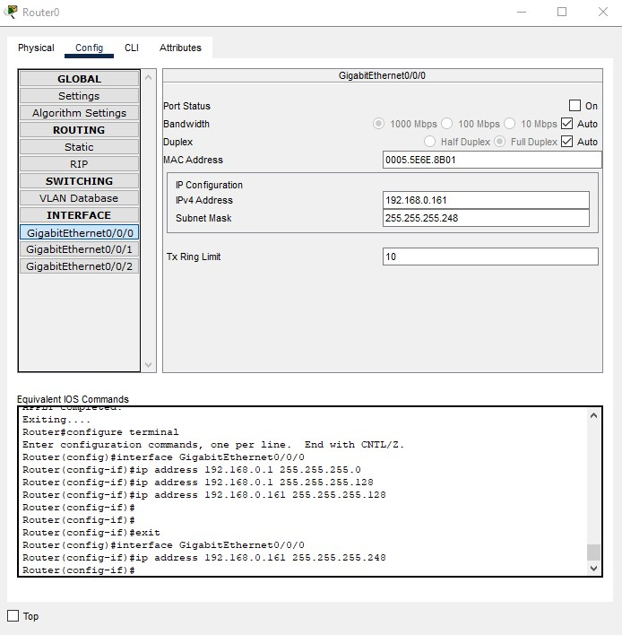
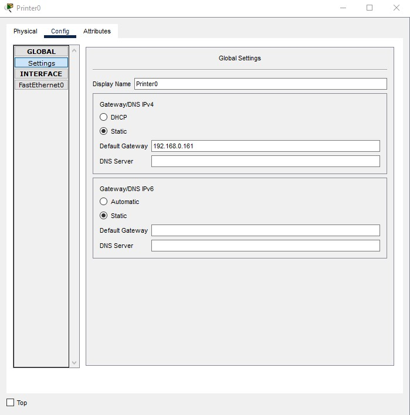
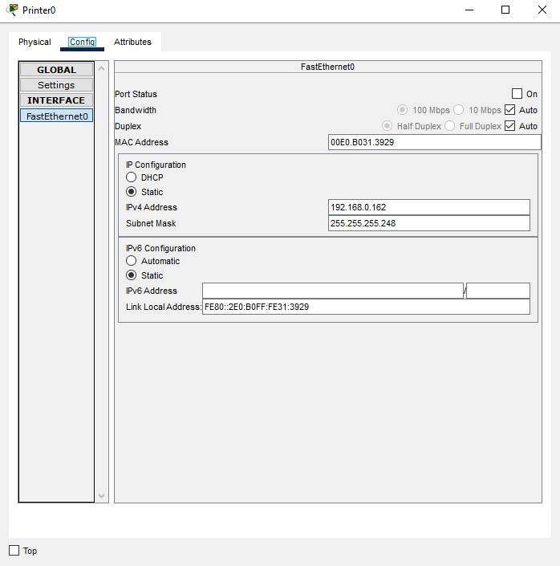
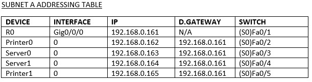
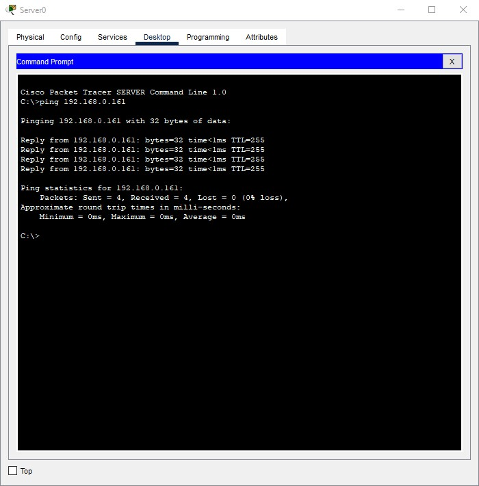
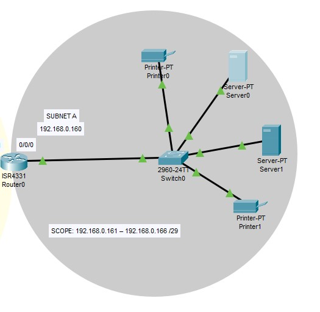
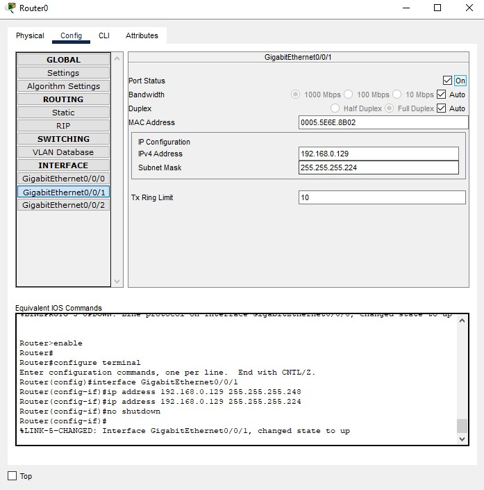
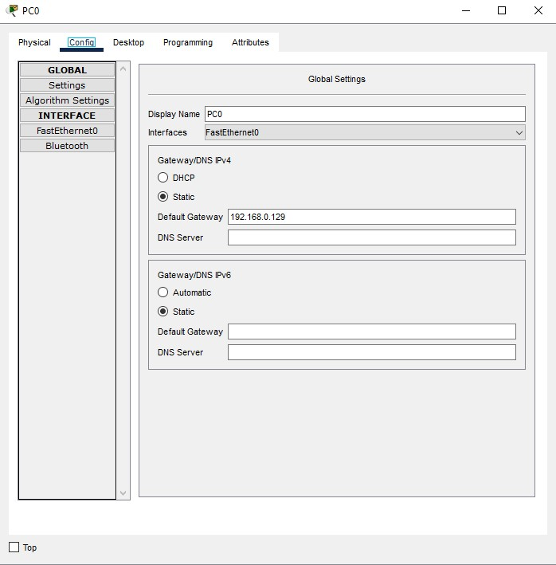
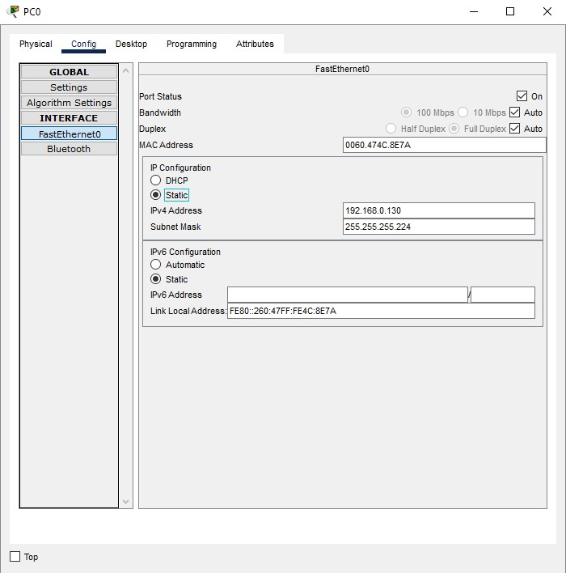
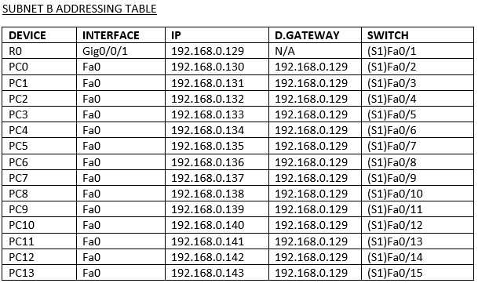

<h1>First Networking Lab - Basic LAN</h1>


<h2>Description</h2>
This project entails the subnetting process, design and configuration of a basic Local Area Network. 
<br />


<h2>Languages/Utilities Used</h2>

- <b>Cisco IOS</b> 

<h2>Environments Used </h2>

- <b>Packet Tracer</b>

<h2>WALK-THROUGH:</h2>

Starting range of 192.168.0.0/24 <br/>

3 different subnets were created:<br/>
•	Subnet A for servers/printers - 4 hosts consisting of 2 servers and 2 printers. <br/>
•	Subnet B for employees - 14 hosts consisting of 14 workstations. <br/> 
•	Subnet C for customers/guests - 72 hosts with Wi-Fi access. <br/>

<h3>Subnetting</h3>
VLSM (Variable Length Subnet Mask) was applied, subnetting for requirements, avoiding wasting IP addresses. <br/><br/>

1. Started with the largest subnet (C) for customers <br/>

192.168.0.0/24 was the beginning of the range. <br/>

First, the subnet mask needed to be converted to binary. The CIDR notation of '/24' represents 24 bits, meaning the subnet mask in binary is 11111111.11111111.11111111.00000000 <br/>

The 1's represent the network bits, with the 0's representing the host bits. I used a table to 'save' bits from the host and convert the rest to the network, to allow for 72 hosts on subnet C. <br/>

 <br/>

Using the bottom row, I sought to find the right amount that could fit 72 hosts, which is 128. Starting from the end of the table with the lowest number, I counted how many fields within the table it took to get to 128. It took 7 fields. <br/>

So, I saved 7 bits from the host bits. I started from the end of the octet, counting 7 bits backwards, saving those. The rest of the bits were converted to the network. <br/>

This converted the subnet mask to 11111111.11111111.11111111.10000000 <br/>

With the new bit in the octet, I counted how many 1's in total, which was 25. This created a classless network (/25). <br/>

I could then find the increment, which specifies the range for that subnet. I found this by locating the last network bit and converting that using the original conversion table. This was 128. <br/>

Now, I could convert the new mask back into decimal. Only the last octet is changing. I counted the bits in the last octet using the original conversion table, which was 128 in total. <br/>

New mask in decimal: 255.255.255.128 <br/>

This gave the complete range of 192.168.0.0 - 192.168.0.127 <br/>

IP's needed to be reserved for the network address and broadcast address. The network address is usually the first IP (192.168.0.0) and the broadcast address is usually the last (192.168.0.127). <br/>

The amount of available hosts (factoring in the network and broadcast address) could be calculated with 2^7 - 2 = 126 <br/>

This gave the available range of 192.168.0.1 - 192.168.0.126 /25 <br/><br/>

2. Next was the the second largest subnet (B) for employees <br/>

192.168.0.128 was the beginning of this range and the subnet mask was 11111111.11111111.11111111.10000000 (both following on from the last) <br/>

Again, I used the conversion table to figure out how many bits I needed to ‘save’ from the host bits… <br/>

 <br/>

Despite needing 14 hosts for this subnet and 16 being the closest, when factoring in the network and broadcast address, having exactly 14 IP addresses would not allow for a router, and it is best practice to have a few extra IPs in the subnet for extra network devices that may be required. <br/>

Jumping to the next, which is 32, takes counting 5. I needed to 'save' 5 bits from the host. Again, once I saved the last 5 bits from the binary address, I converted the rest to the network. <br/>

The new mask in binary: 11111111.11111111.11111111.11100000 <br/>

New CIDR: (8+8+8+3) /27 <br/>

Increment: 32 <br/>

New mask in decimal: (128 + 64 + 32 = 224) 255.255.255.224 <br/>

This gave the complete range of: 192.168.0.128 - 192.168.0.159 <br/>

I needed to reserve the network address (192.168.0.128) and the broadcast address (192.168.0.159) <br/>

2^5 - 2 = 30 available hosts <br/>

Available range: 192.168.0.129 - 192.168.0.158 /27 <br/><br/>

3. Lastly, the smallest subnet (A) for servers/printers <br/>

192.168.0.160 was the beginning of this range. The subnet mask in binary was 11111111.11111111.11111111.11100000 <br/>

 <br/>

Similarly to subnet B, the exact amount (4) would not provide enough space for the network and broadcast address as well as any routers. So, I jumped to 8, saving 3 bits, converting the rest to the network. <br/>

New mask in binary: 11111111.11111111.11111111.11111000 <br/>

New CIDR: (8+8+8+5) /29 <br/>

Increment: 8 <br/>

New mask in decimal: (128+64+32+16+8 = 248) 255.255.255.248 <br/>

This gives the complete range of 192.168.0.160 - 192.168.0.167 <br/>

Reserve network address (192.168.0.160) and broadcast address (192.168.0.167) <br/>

2^3 – 2 = 6 available hosts <br/>

Available range: 192.168.0.161 – 192.168.0.166 /29 <br/></br>

<h3>Design</h3>
Once I created the subnets, I could design the network via Packet Tracer.

 <br/>

This screenshot displays my design. I colour-coded and labelled each subnet: Subnet A (grey), Subnet B (yellow) and Subnet C (green), all labelled with each network address and range/scope which I had already found via subnetting. <br/>

<b>Subnet A</b><br/>
Topology: Star <br/>
Scope: 192.168.0.161 – 192.168.0.166 /29<br/>
Subnet Mask: 255.255.255.248 <br/>
This subnet consists of two servers and two printers which will each be connected to the switch (Switch0) and this switch will then be connected to the router (R0) which is the gateway router, allowing communication to Subnet B.<br/>

<b>Subnet B</b><br/>
Topology: Star<br/>
Scope: 192.168.0.129 - 192.168.0.158 /27<br/>
Subnet Mask: 255.255.255.224<br/>
This subnet consists of fourteen desktop PCs. Each PC will be connected to the switch (Switch1). This switch will be connected to the router (R0) which is the gateway router, allowing communication to Subnet A.<br/>

<b>Subnet C</b><br/>
Topology: Mesh<br/>
Scope: 192.168.0.1 - 192.168.0.126 /25 <br/>
Subnet Mask: 255.255.255.128 <br/>
This subnet consists of a wireless router and despite showing four end devices, it will allow for up to 126 wireless devices to connect to Wi-Fi, fulfilling the requirement of 72 customer devices. The wireless router cannot communicate with Subnet A or B to increase security for Subnet A and B.<br/>

<h3>Configuration</h3>
I connected all devices with a combination of straight-through and crossover copper ethernet cables. I then configured all devices as shown below... <br/><br/>

<b>Subnet A</b><br/>
All devices within this subnet were configured with static IPs. Both servers and printers in a business setting are constantly required for basic job functionality and servers must always be online and stable as they are holding important and sensitive data. <br/><br/>

 <br/>
The router was connected to Subnet A via interface 0/0/0. I assigned this interface its IP; the first within the scope of Subnet A and subnet mask. <br/><br/>

 <br/>
Next, I configured the end devices in Subnet A to point to the default gateway. Here I am showing Printer0 specifically, but this was replicated on all end devices. <br/><br/>

 <br/>
Next, I configured the end devices in Subnet A with their IPv4 address and subnet mask. This shows Printer0 where I configured it to have the next available IP. I continued this process with the other devices. <br/><br/>

 <br/><br/>

To verify connectivity, I sent ping requests to and from the gateway and devices... <br/><br/>

 <br/>
Starting with the gateway, I had to come out of configuration mode by ‘exit’-ing twice. I then sent a ping request to Printer0. It only returned 80%. This is due to the fact that the device needs to go through the process of being recognised by the gateway first (ARP request). Once that ARP data was received via the first ping, the second ping returned with a complete success rate. This was replicated for all devices in Subnet A with success.<br/><br/>

 <br/>
Demonstrating successful communication to gateway<br/><br/>

 <br/><br/>

<b>Subnet B</b><br/>
All devices (desktop machines) in this subnet were also configured with static IPs. This is important for organisational structure and security.<br/><br/>

 <br/>
The router was connected to Subnet B via interface 0/0/1. I assigned this interface its IP; the first within the scope of Subnet B, and subnet mask, and turned it on. This router also acts as the default gateway for this subnet.<br/><br/>

 <br/>
Next, I configured the end devices in Subnet B to point to the default gateway. Here I am showing PC0 specifically, but this was replicated on all end devices.<br/><br/>

 <br/>
Next, I configured the end devices in Subnet B with their IPv4 address and subnet mask. This shows PC0 where I configured it to have the next available IP. I continued this process with the other devices. <br/><br/>

 <br/><br/>


<p align="center">
Launch the utility: <br/>

<br />
<br />
Select the disk:  <br/>

<br />
<br />
Enter the number of passes: <br/>

<br />
<br />
Confirm your selection:  <br/>

<br />
<br />
Wait for process to complete (may take some time):  <br/>

<br />
<br />
Sanitization complete:  <br/>

<br />
<br />
Observe the wiped disk:  <br/>

</p>

<!--
 ```diff
- text in red
+ text in green
! text in orange
# text in gray
@@ text in purple (and bold)@@
```
--!>
